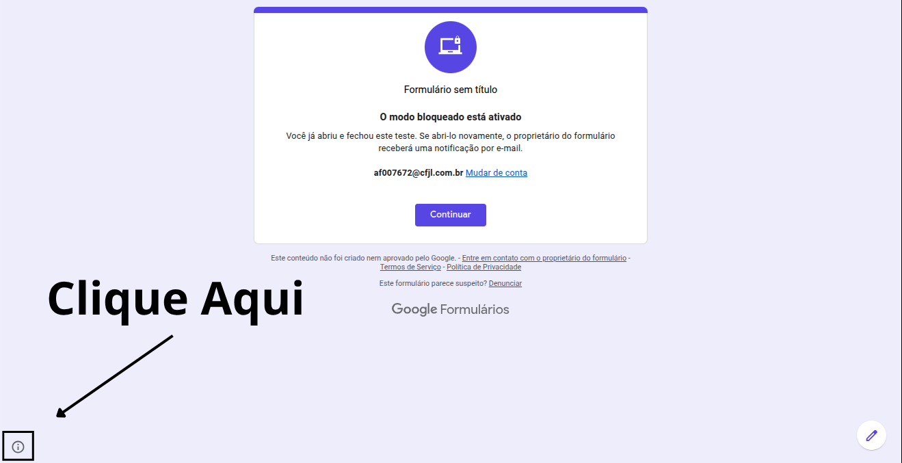

# Forms Unlocker Invisible

Userscript para Google Forms, compatível com [Tampermonkey](https://www.tampermonkey.net/) e [Violentmonkey](https://violentmonkey.github.io/).

## Instalação

### Tampermonkey

1. Instale o [Tampermonkey](https://www.tampermonkey.net/).
2. Abra a extensão e clique em **Create a new script**.
3. Apague o conteúdo padrão.
4. Copie todo o conteúdo do [`script.js`](./script.js) e cole no editor.
5. Salve com **Ctrl + S**.

### Violentmonkey

1. Instale o [Violentmonkey](https://violentmonkey.github.io/).
2. Abra a extensão e clique em **New**.
3. Apague o conteúdo padrão.
4. Copie todo o conteúdo do [`script.js`](./script.js) e cole no editor.
5. Clique em **Save**.

Também é possível abrir o arquivo `script.js` no GitHub, clicar em **Raw** e confirmar a instalação no gerenciador de userscripts.

## Como ativar

1. Abra o painel do Tampermonkey ou Violentmonkey.
2. Localize **Forms Unlocker Invisible**.
3. Ative o interruptor do script.
4. Abra ou recarregue uma página do Google Forms.

## Como usar

1. Abra o Google Forms com o script ativado.
2. Aguarde o carregamento da página.
3. Clique no canto inferior esquerdo da janela, na área indicada na imagem abaixo.
4. A página será recarregada e o script será executado.

### Posição do botão

O botão é invisível e fica no **canto inferior esquerdo da janela**, dentro da área marcada pela seta:

A área clicável tem aproximadamente **64 × 64 pixels**. Se o navegador estiver com zoom ou tamanho de janela diferente, procure sempre o canto inferior esquerdo.

## Problemas comuns

- Confirme que o script está ativado no Tampermonkey ou Violentmonkey.
- Recarregue a página depois de instalar ou ativar o script.
- Verifique se a página começa com `docs.google.com/forms/`.
- Se não funcionar, desative outros userscripts que alterem o Google Forms e tente novamente.

## Arquivos

- [`script.js`](./script.js) — userscript principal.
- [`CliqueA.png`](./CliqueA.png) — imagem mostrando a posição do botão.
